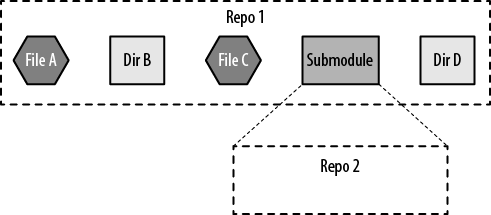

> # 1. 학습 날짜
- **2020년 12월 22일 화요일**

<br />

> # 2. 학습시간 (5 시간)
- **00:00 ~ 03:00 (3 시간)** 호텔
- **15:00 ~ 17:00 (2 시간)** 집

<br />

> # 3. 학습 범위 및 주제
- **Git Submodule**
- **Vim Navigation**

<br />

> # 4. 동료 학습 방법
- **00:00 ~ 03:00** 오프라인 스터디 *(dher, junsekim, junshin)*
- **15:00 ~ 17:00** 자가학습

<br />

> # 5. 학습 동기 및 목표
- Git Submodule
	- Github의 개인 42Seoul 저장소 내에 42Seoul 레포트 저장소를 같이 관리하면 좋을 것 같다고 생각됨
	- 추후에 큰 프로젝트를 진행할 때 서브모듈을 자유자재로 사용함으로써 종속적으로 사용되는 다른 저장소를 쉽게 관리할 수 있도록 함
- Vim Navigation
	- Vim에 익숙하지 않아 코드 내에서 커서 및 화면을 이동할 때 비효율적으로 방향키를 연타하게 됨
	- Vim Navigation에 익숙해짐으로써 GUI 환경의 에디터에서 작업할 수 없는 환경에서 GUI 에디팅 속도 못지 않은 코딩 속도를 발휘할 수 있도록 함

<br />

> # 6. 상세 학습 내용
- 실제 코딩에 사용한 시간: **2 시간**

- 참고 자료
	- [Git Tools - Submodules | git-scm.com](https://git-scm.com/book/en/v2/Git-Tools-Submodules)
	- [저장소 안에 저장소 - git submodule | 생활코딩](https://www.youtube.com/watch?v=TAe4uZqYt6c)
	- [Vim Navigation Commands | thoughtbot](https://www.youtube.com/watch?v=Qem8cpbJeYc)

<br />

> ### 1. 깃 서브모듈이란?
> 
- 깃 서브모듈은 말 그대로 서브-모듈이다. 한 부모 저장소 안에 다른 자식 저장소가 들어가는 구조이다.
- 부모 저장소 안에 포함된 자식 저장소는 부모 저장소에 디렉토리로 어느 위치에서나 존재할 수 있다.

> ### 2. 깃 서브모듈의 장점
- 종속되는 여러 저장소들을 한 번에 관리할 수 있다.
- 서브모듈의 리비전을 자유자재로 체크아웃할 수 있다.
- 여러 저장소 각각의 버전들을 단순히 파일로 저장하지 않고 버전의 해시를 기록함으로써 서브모듈이 많아도 용량을 효율적으로 관리할 수 있다.
- 각 서브모듈들에 대해 명령어를 실행하여 쉽게 관리할 수 있다.

> ### 3. 깃 서브모듈 사용법
1. 우선 서브모듈을 포함할 부모 저장소와 부모 저장소에 서브모듈로서 포함될 자식 저장소를 준비한다.
	- 예) 부모 저장소: **42seoul-jleem** (github.com) / 자식 저장소: **report** (git.innovationacademy.kr)
2. `git remote -v`를 통해 자식 저장소의 주소를 알아낸다.
	- jleem/report 저장소에 대해 `git remote -v`를 수행한 결과
		```
		origin  gits@git.innovationacademy.kr:jleem/report.git (fetch)
		origin  gits@git.innovationacademy.kr:jleem/report.git (push)
		```
	- 자식 저장소의 주소: **gits@git.innovationacademy.kr:jleem/report.git**
3. 부모 저장소에서 `git submodule add` 명령어를 통해 자식 저장소를 서브모듈로 추가한다.
	- 부모 저장소에서 `git submodule add gits@git.innovationacademy.kr:jleem/report.git report` 실행
	- 해당 명령을 실행하면 서브모듈의 위치와 저장소의 주소를 담고 있는 .gitmodules 파일이 생성된다.
		- .gitmodules 파일의 모습
			```
			[submodule "report"]
			path = report
			url = gits@git.innovationacademy.kr:jleem/report.git
			```
	- 그리고 

<br />

---

> # 7. 학습 내용에 대한 개인적인 총평

나는 개인 github 저장소에 프로젝트 관련 내용들을 관리하는데
위키의 저장소
unlike vogsphere

- 바이너리를 추가하면 용량이 커지는 문제를 겪어봤었는데
- 자식 저장소를 그냥 버전별로 관리하게 되면 저장소 용량이 무지하게 


<br />

> # 8. 다음 학습 계획
- Vim Navigation
- libft
